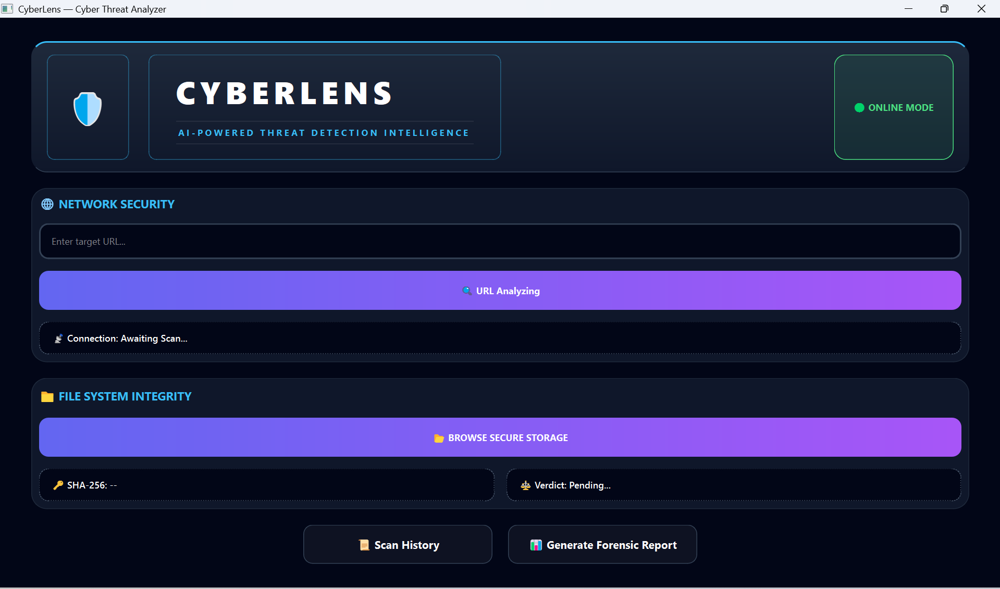
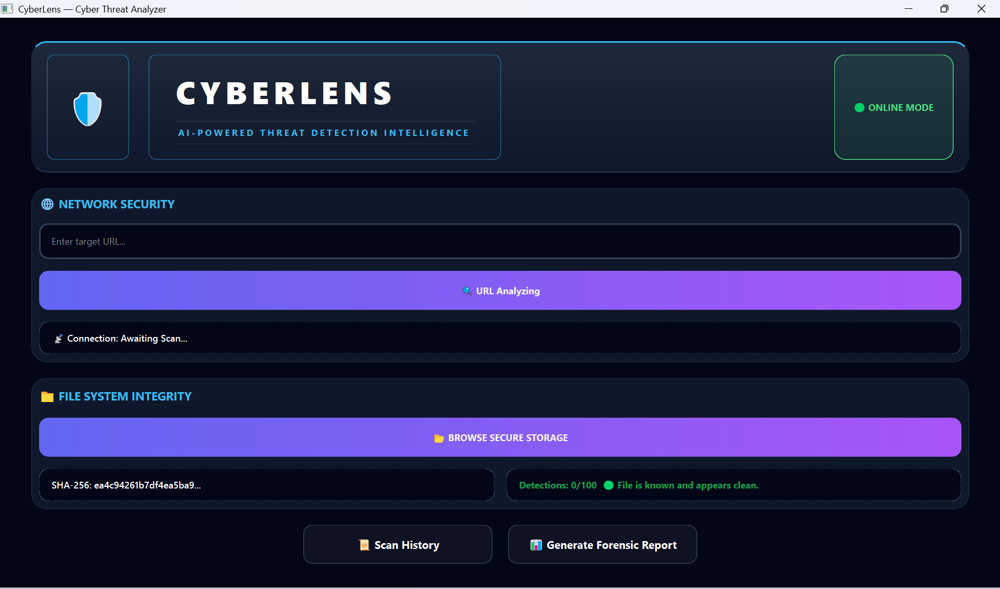
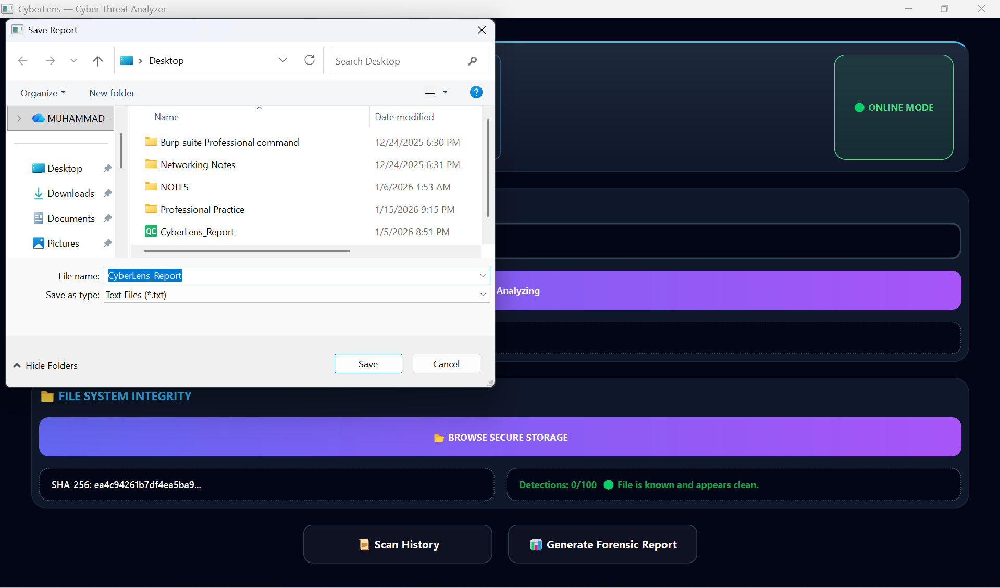
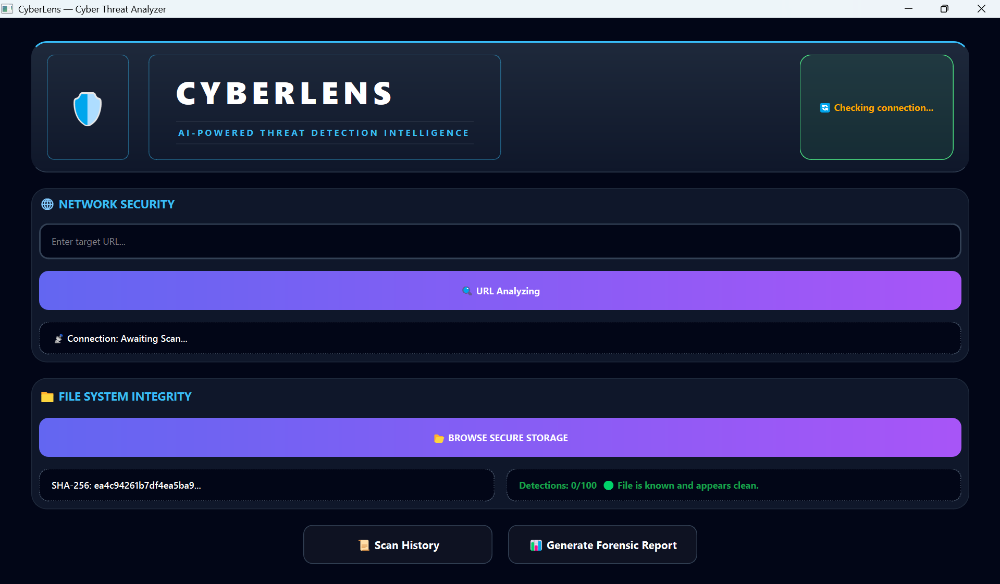

# 🔍 CyberLens

CyberLens is a modern desktop cybersecurity application designed to scan URLs and files
for potential security threats. The project focuses on detecting malicious URLs
(phishing, malware domains) and identifying suspicious files using hash-based analysis.

CyberLens is built primarily for educational and personal cybersecurity use and demonstrates
practical implementation of secure coding, networking, and malware detection concepts.

--

## ✨ Features

- Intuitive graphical user interface built with Qt Widgets  
- URL analysis and threat detection  
- File scanning using cryptographic hash computation  
- Scan history tracking and management  
- Modular architecture for easy feature extension  
- Lightweight and fast desktop application  

---
## 📸 Screenshots

**Main Application Window**  

**File Scanning Example**  

**URL Scanning Example**  

**Scan History View**  

**Report Generation / Results**  

**Network Checker Interface**  

## 🛠️ Tech Stack

- **Programming Language:** C++ (C++17 or later)  
- **Framework:** Qt 6 (Widgets & Network modules)  
- **Build System:** CMake  
- **Platform:** Cross-platform (Windows / Linux)  

---

🎯 Learning Outcomes

Practical experience with cybersecurity concepts

Secure coding practices in C++

URL threat analysis techniques

File hashing and integrity checking

Desktop application development using Qt

🚀 Future Enhancements

Integration with online threat intelligence APIs

PDF/CSV report export

Real-time URL monitoring

Improved malware detection logic

🎯 Learning Outcomes

Practical experience with cybersecurity concepts

Secure coding practices in C++

URL threat analysis techniques

File hashing and integrity checking

Desktop application development using Qt

🚀 Future Enhancements

Integration with online threat intelligence APIs

PDF/CSV report export

Real-time URL monitoring

Improved malware detection logic

👤 Author

Muhammad Jamshed

Cybersecurity Student

GitHub:https://github.com/JAMSHEDKHOSA57

